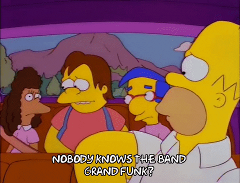

# Random Band Name Generator

In this program, we are supposed to take user input and generate a band name using a place name and type of animal. 

The programs takes two user inputs for the name of the band and prints out the name of the band by concatinating the names. The play again loop asks the user if they want to generate a new name or if they are satisfied and want to exit.
