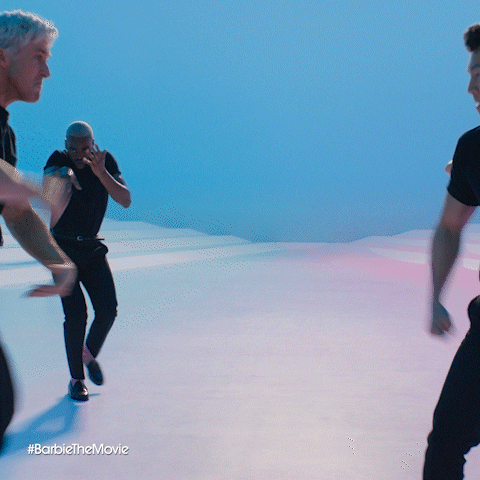

# Rock Paper Scissors!

This program turns the terminal into the ultimate rock, paper, scissors battle arena where you can compete with the computer all you want! 

It takes a choice from the player, then takes a random choice from the computer. It compares both the choices and checks who is the winner of the game. Then it prints out the current winner and also prints out the total number of games the player and computer have won respectively.

After each game, it gives the player an option to play again.