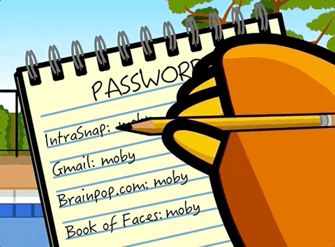

# Password generator

Security 101: Using the same password for all your accounts is a recipe for disaster. 

To solve this problem, Spies and Sons Inc. invented a revolutionary password generator. 

This program takes in inputs for the number of alphabets, digits and symbols a user wants in their password. Then it generates a password with randomly choosen options for each. It returns a scrambled password according to the user's request.

Password crisis, solved! 