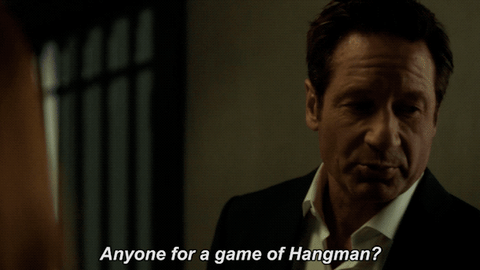

# Hangman

This is a game of Hangman!

The program takes a random word from a list of words and generates a word of blanks using the same. The blanks, guessed letters and the hangman art is displayed to the player. 

On each turn the player is supposed to guess a letter. If the letter is in the word, the blanks get replaced with the letter at each instance of its occurrence. The game goes on till either the player guesses all the blanks correctly or till the hangman art gets completed and the player looses all lives. 

When the game gets over, the program prompts the user to select if they want to play again or end the game. 