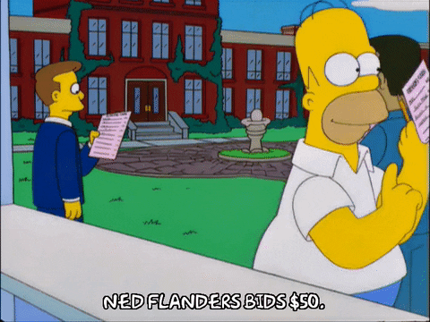

# Silent Auction

A very special 18th century rocking horse has come into the possession of the auction committee and a silent auction is being held for it.

The program asks the bidder for their bid. Then asks them if other bidders exist. If others want to participate in the bid, the program clears the screen to hide the previous bidder's information. When there are no other bidders, the program completes the auction and prints the information of the highest bidder.
