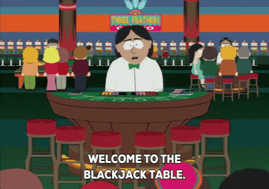

# Silent Auction

Bring in your coin pouches because this is a game of BlackJack! (But not really because we are using virtual fake money for this.)

The program starts with asking how much the player wants to bet for the round. After the player enters the bet, 2 random cards are drawn for the player and their respective arts are printed on the screen. 

If the player doesn't already have BlackJack then a card for the dealer is drawn and the player is asked if they want to hit (draw another card) or stand . If the player chooses to draw a card, then the new updated hand is printed. This goes on till the played says they don't want to 'hit' anymore. The cards for the dealer are then drawn till the dealer's total is lower than 17. 

After drawing the cards, if the dealer has BlackJack or the dealer's total is over the player's total then the dealer wins and the bet amount gets removed from the player's bank. If the dealer goes bust or player's total is higher, the player wins the game. The bet amount is added to the player's bank. The player is then asked if they want to play another round and the game continues. 

If the bank reaches 0 or if the player doesn't want to play anymore, the game stops. 

