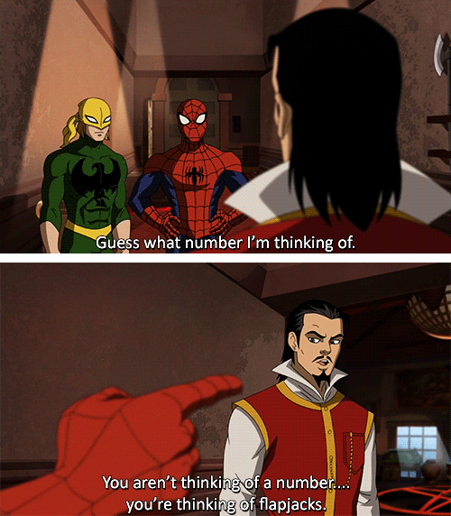

# Number Guessing Game

This is a number guessing game.

The computer thinks of a number between 1-100 and asks the player to guess the number. First, the computer takes input for the mode the player wants to play at, easy or hard. Based on that the computer allocates number of guessing turns. 

Next, the computer takes in a guess from the player as input, it checks if the guess is equal to the number. If not, the computer checks if the guess is higher or lower and prints the feedback on the guess. This goes on either till the player guesses correctly or the number of turns is over and the player wins or loses respectively.

After each game the player is given the option to play again.