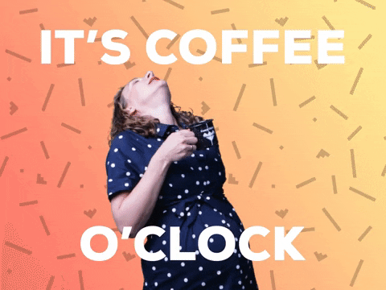

# Coffee Machine

This is a virtual coffee machine, the coffee served by this machine may be decaf but it tastes a lot like coding victory! 

When the machine boots up it takes a simple input, what kind of coffee the customer wants. Now, there are 4 possible options that can be typed in:

### For the barista
The barista's have secret keywords, that are not displayed on the screen but are valid inputs that can be used to perform certain functions.

- OFF : The off command turns the machine off and ends the program.
- REPORT : The report command prints a list of ingredients and their quantities left in the machine. It also prints the total profit made by the machine in each cycle before the machine is turned off.
- REFILL : If a barista hits refill, the machine is refilled and all ingredient quantities are updated to original.

### For the customer 

The customer is asked which type of coffee do they want - Espresso, Latte or Cappuccino. Based on what the customer selects, the machine checks if it has the ingredients. If an ingredient is missing the machine displays that it's out of that ingredient.

If the machine has all the required ingredients, the customer is asked for money which they can put in coins. Once the customer enters the number of each variety of coin they want to put in, the machine checks if it is enough money for the coffee, if not the money is returned and no coffee is served. 

If the user put in the money required then a coffee is served, if the money was more than the price of the coffee then change is returned and the ingredients get updated. 

The machine prompts the question again after a coffee is served.
