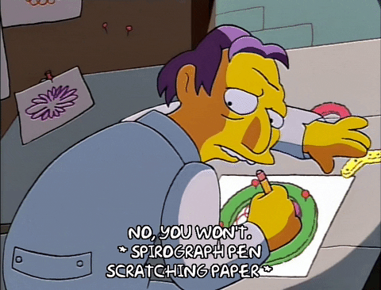

# Turtle Graphics

DISCLAIMER: No turtles were harmed in the making of these programs! 

### Square
Using the turtle module we start in the middle and move 200 steps ahead then make a right turn and repeat 4 times.

### Dashed line
We move 5 steps ahead, pick up the pen and move 5 steps ahead again. Then we put down the pen and repeat the cycle 20 times.

### Different shapes
We start with 3 as our number of sides. For each shape the angle to turn will be 360 divided by the number of sides in the shape. Then while number of sides is less than 11 (since our aim is to go to a decagon) we pick a random color for the shape using the random module and random RGB values, then for each shape we move forward 5 spaces and turn the calculated angle till for the number of sides in each shape. 

### Random Walk
We make a list of possible directions in which the turtle can face right before moving forward. Next we pick a random color for the step and a random direction and move forward 20 steps. We repeat this for as many steps we want the turtle to move before stopping.

### Spirograph

For a spirograph we have to make a circles starting from the same center and shifted by a certain angle. For this we simply make a circle then shift the turtle's head by 5 degrees each time and make a new circle. We do this till the angle shifted reaches 360 degrees. 