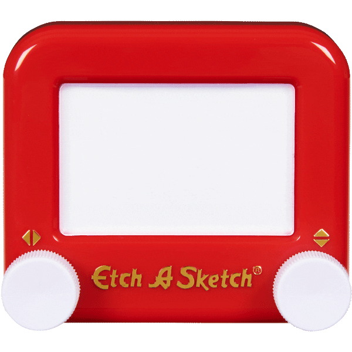

# Etch-A-Sketch

For etch a sketch we define 5 functions for each type of action we can perform.

- `move_forward()` function moves the turtle 10 steps ahead when we press the 'Up' arrow key. 
- `move_backward()` function moves the turtle 10 steps back when we press the 'Down' arrow key.
- `rotate_clockwise()` function rotates the turtle 10 degrees to the right when we press the 'Right' arrow key. 
- `rotate_anticlockwise()` function rotates the turtle 10 degrees to the left when we press the 'Left' arrow key. 
- `clear()` clears the screen and brings the turtle to the starting center position when we press 'c'. 

In the main program loop, the screen constantly listens to the key presses and based on which key is pressed calls the corresponding function.