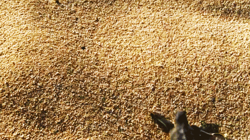

# Turtle Race

We make 5 turtle objects and assign each one a random color using the random RGB values and a different starting position using the same x coordinate value and y coordinate values that are 50 steps apart so the are all in a vertical line at the starting position. 

After we arrange the turtles we ask the user which turtle do they want to bet on. (The turtles are all named after famous fictional turtles.)

After the bet is taken, the race starts and the program checks if any turtle has reached the end, if not then each turtle moves a random number of steps between 0 to 10, until a turtle finally wins. 

The program checks if the user picked the winner and accordingly prints a message.