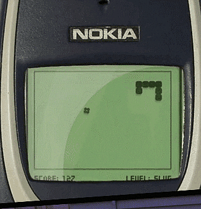

# Snake Game

This is a classic snake game made using Object Oriented Programming. 

### Snake Class

The snake class initializes square segments of a snake and chains them together in an array. Further it has methods for adding new segments when a food is eaten and motion mechanics of the snake.

### Food Class

The food class initializes the food particles and has a method that moves the food to a new random location after the snake eats the food.

### Score Class

The score class initializes score on the screen, if the snake eats the food, score gets increased and updated. If the snake hits the wall or any part of its body, game over message is printed on the screen.

The program initializes the screen, food and score, and constantly listens for the key inputs. It changes direction of the snake based on the key pressed and refreshes the screen. If the snake eats food, it moves the food to a new location and increases the score and snake length.

If the snake collides with the wall or itself, the program stops and triggers the game over message.

### Additional Changes
'highschool.txt' stores the high score which gets loaded every time a new game is loaded. If the player manages to get a score higher than the current high score, the high score in the file gets replaced with the new score.