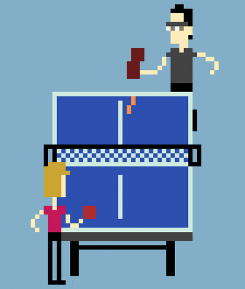

# Ping Pong Game

A fun game of Ping Pong using Object Oriented Programming. 

### Paddle Class
Makes an elongated Paddle and adds movement to go up and down for the right player when the 'Up' and 'Down' arrow keys are pressed and for the left player when the 'W' and 'S' keys are pressed.

### Ball Class
The ball class declares a turtle that moves across the board, if it hits the top or the bottom, it bounces away from the wall. If a player hits the ball, then the ball bounces away from the paddle. Each time a player hits the ball, the ball bounces back at a random speed. When the player misses the ball, the ball is reset to its original position and restarts its path.

### Score Class
Defines a turtle that writes the score for each player at the top of the screen when a player scores a point, the score is rewritten to update the previous score. When one player reaches 11, which is the winning score in ping pong, the game-over message is written and the winner is declared on the screen.

### Net Class
(Optional)
The net class defines a turtle that makes a dashed line across the screen to give the illusion of a net.
