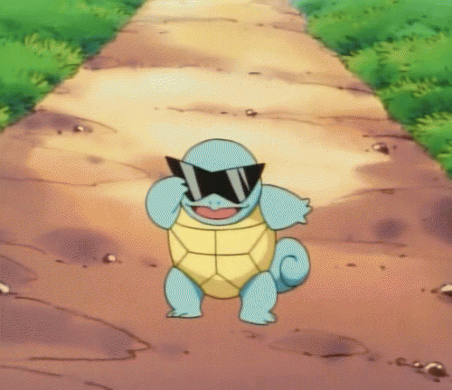

# Turtle Crossing

A fun game of Turtle Crossing inspired by [Crossy Road](https://www.crossyroad.com/) using Object Oriented Programming. 

### Turtle Player Class
Makes a turtle at the bottom of the screen that's heading north and defines a function for moving it forward on the screen. Also defines a function to reset the turtle to its original position.

### Car Class
The car class initializes a list of cars, makes cars in random colors and adds them to the list of cars. It also defines a function to move cars forward from the right of the screen to the left continuously. It also defines a function to increase the speed of the cars.

### Score Class
Initializes a turtle that prints the current score at the top left of the screen and prints a game over message after the game ends.

When the player stars the game a turtle shows up at the bottom of the screen and they have to make their way to the top of the screen using the 'Up' arrow key. If the player safely crosses over their score increases by 1 and the car speed increases slightly. If the turtle get's squished under a car, the game over message is triggered and the final score of the player is displayed at the center of the screen.
