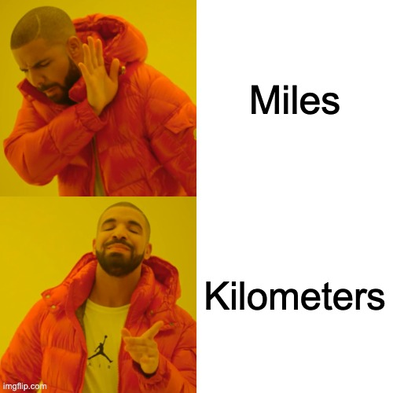

# Miles to Kilometers convertor

Visiting USA and realizing USA's aversion to using metric system runs deep? 

Need a handy miles to kilometer converter? Look no more, here's one designed just for you!

### How it works

The window is defined and the labels are added. The textbox entry box is initialized with 1 mile and the label is configured with the equivalent kilometer value. The user can type different values in the entry box and press the convert button, the button initiates a function to convert miles to kilometers and changes the label to reflect the correct value.
