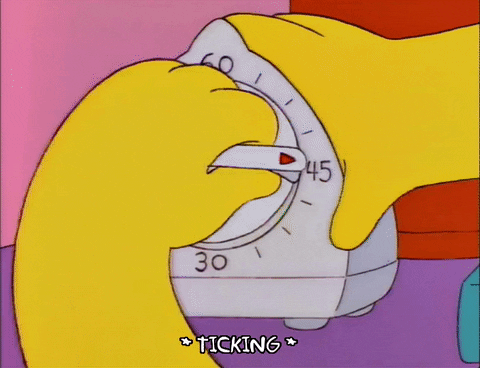

# Pomodoro Timer

Want to be efficient using the [Pomodoro Technique](https://en.wikipedia.org/wiki/Pomodoro_Technique) but want to go through the hassle of getting up to set a kitchen timer? 

Then this app is for you, this is the initiative to break the loop of procrastination and start getting on those tough tasks! 

### How it works

The color palette is first defined and the times are preset using constants at the top of the program.

There are 3 key functions in the program, 

1. Set Timer - This function notices what stage we are on and based on that sets the timer to a particular value, namely 25 mins for work sections, 5 mins for short breaks and 20 mins for long breaks.

2. Timer countdown - This function is the brain behind the timer, it takes the total time in second and calculates the minutes and seconds left each second and changes it on the canvas accordingly.

3. Reset timer - This function resets the stage we are at and the timer values after being called. 

The program has set work and break intervals that the timer counts down to, as specified in the Pomodoro Technique. Once the user presses the 'Start' button, the timer starts the cycle. If the user wants to reset the timer in between the on-going cycle or when the cycle is complete, they can press the 'Reset' button. 

# External resources used 

- The color palette is selected from [ColorHunt](https://colorhunt.co/palette/ffe6e6e1afd1ad88c67469b6)

- The tomato image is sourced from [Blankboard icons created by Buandesign - Flaticon](https://www.flaticon.com/free-icons/blankboard)