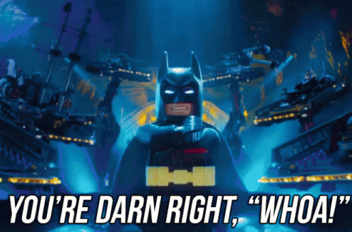

# LEGO Data Analysis 

This is an analysis of the [LEGO dataset](https://www.kaggle.com/datasets/rtatman/lego-database?select=colors.csv) 

The analysis covers the colors, themes and sets datasets and generally explores the color options lego offers, the popularity of certain themes and sets and how sets and themes have eveolved since the early years of lego.